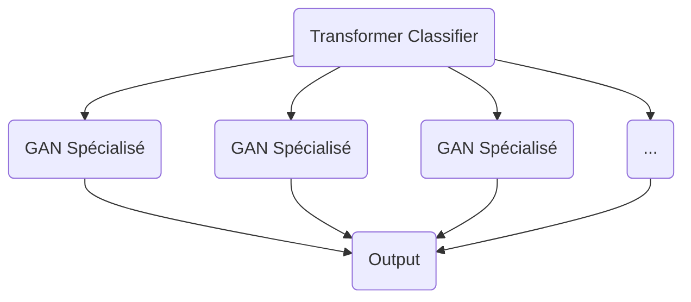
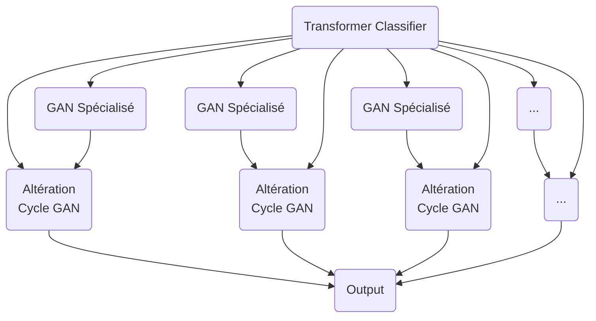
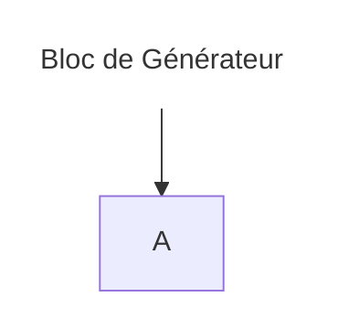
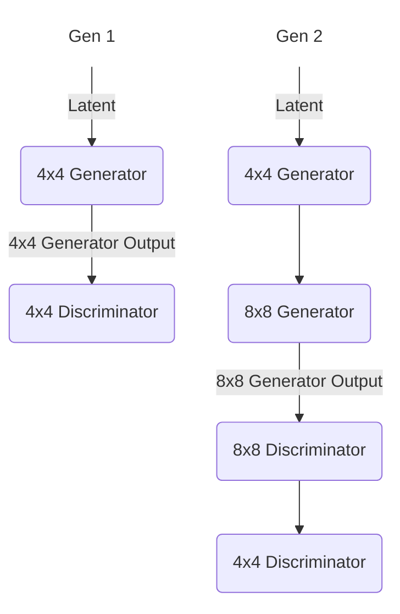
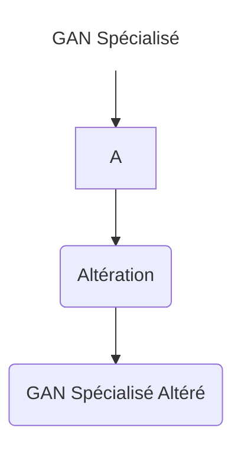

# IA_GAN_NLP

## Goal:
Le but de ce projet est de réussir a créer un modèle prennant une description textuelle en entrée pour générer une image de sortie.
Dans le but d'obtenir les sorties les plus cohérentes possibles, nous créerons plusieurs GAN chacun spécialisé dans la création d'une classe d'image.
Une modèle de Transformer s'occupera de la classification pour choisir le GAN a appeler.

En fonction du temps nécessaire pour les entraînements, nous tenterons plusieurs modèles, en particulier sur les GAN.
Nous pourrons aussi, si le temps nous le permet augmenter l'architecture avec une couche d'altération.

## Structure

### Structure Simple

### Avec Altération

## ProGAN

Le ProGAN est un GAN que l'on fait progressivement grossir a chaque étape.

On commence par générer des images 4x4 avec un block de génération, puis, après un premier entrainement, on ajoute un block commençant par un Upsampling doublant la résolution, et un Layer d'interpolation.

Ce modèle a été utilisé pour générer des images de haute qualité.

[Publication de recherche](https://arxiv.org/pdf/1710.10196)

[source de l'implementation utilisée](https://github.com/DCtheTall/tf-keras-progressive-gan/blob/master/colab/progressive_gan.ipynb)

## Architecture

## CycleGAN
Le CycleGAN est un modèle de réseau génératif utilisé pour apprendre la correspondance entre deux ensembles de données sans correspondance directe. 

Dans ce contexte, nous utilisons le CycleGAN pour apprendre la transformation entre les images générées par les GAN spécialisés et les versions altérées de ces images.

## Architecture

Dans l'architecture présentée, nous avons deux parties principales :

1. **GAN Spécialisé** : Il s'agit d'un modèle de réseau génératif spécialisé conçu pour générer des images dans un domaine spécifique. Par exemple, dans le contexte des images de chevaux, le GAN spécialisé apprendrait à générer des images réalistes de chevaux. Ces images peuvent être créées à partir de zéro ou être une transformation de données d'entrée, selon la conception du GAN.

2. **Altération avec CycleGAN** : Cette partie utilise le modèle CycleGAN pour altérer les images générées par les GAN spécialisés. Le CycleGAN est un type de réseau génératif adversaire qui apprend à transformer des images d'un domaine source en images d'un domaine cible, sans nécessiter de correspondance directe entre les paires d'images dans les deux domaines. Dans notre cas, les images générées par les GAN spécialisés servent de domaine source, tandis que les images altérées constituent le domaine cible.

L'ensemble du processus fonctionne de la manière suivante :

- Les images générées par les GAN spécialisés sont envoyées à l'étape d'altération avec le CycleGAN.
- Le CycleGAN utilise son modèle entraîné pour transformer ces images selon le style ou les caractéristiques souhaités. Par exemple, il peut altérer les images de chevaux pour qu'elles ressemblent davantage à des zèbres, ou pour ajouter des caractéristiques artistiques spécifiques.
- Les images altérées peuvent ensuite être utilisées comme sortie finale, ou être soumises à d'autres traitements, comme la classification ou d'autres formes de transformation d'image.

Cette architecture permet de créer un processus en boucle où les GAN spécialisés génèrent des images de départ, qui sont ensuite transformées par le CycleGAN pour produire une variété d'images altérées. Cela permet d'augmenter la diversité et la qualité des données générées, ainsi que d'explorer différentes variations de styles ou de caractéristiques dans les images finales.
