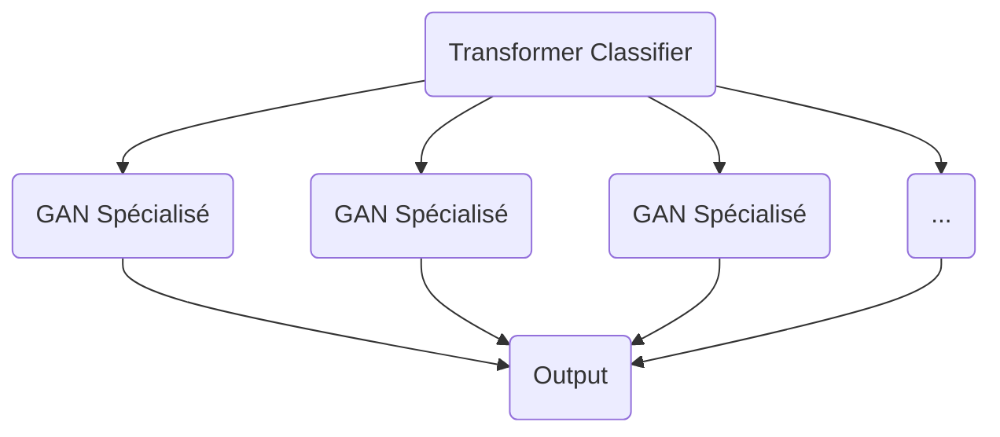
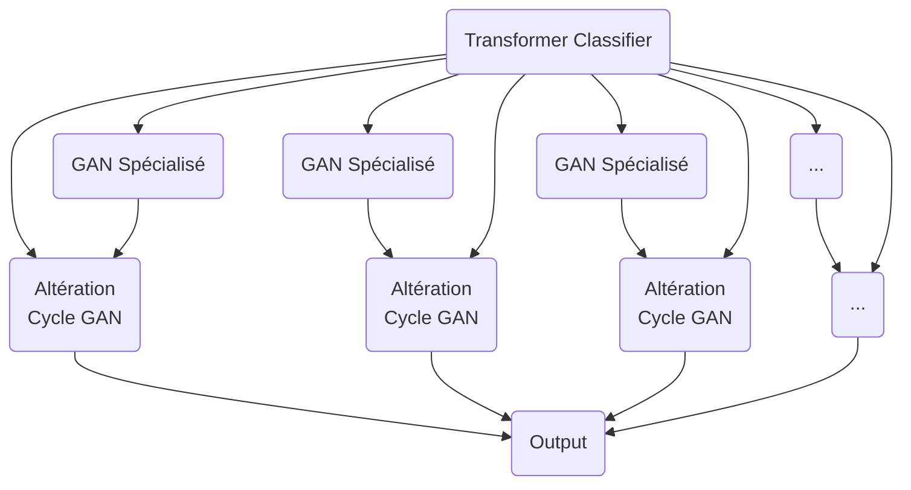

# IA_GAN_NLP

## Goal:
Le but de ce projet est de réussir a créer un modèle prennant une description textuelle en entrée pour générer une image de sortie.
Dans le but d'obtenir les sorties les plus cohérentes possibles, nous créerons plusieurs GAN chacun spécialisé dans la création d'une classe d'image.
Une modèle de Transformer s'occupera de la classification pour choisir le GAN a appeler.

En fonction du temps nécessaire pour les entraînements, nous tenterons plusieurs modèles, en particulier sur les GAN.
Nous pourrons aussi, si le temps nous le permet augmenter l'architecture avec une couche d'altération.

## Structure

### Structure Simple

### Avec Altération

