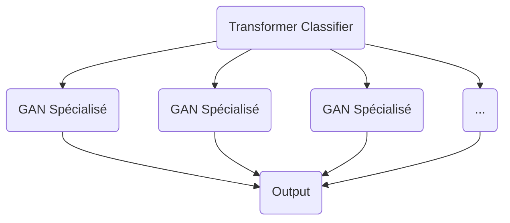

# IA_GAN_NLP

Créer une architecture Multi-Modale telle que:

```mermaid
   graph TD;
   A("Transformer Classifier")-->B("GAN Spécialisé");
   A-->C("GAN Spécialisé");
   A-->D("GAN Spécialisé");
   A-->E("...");
   B-->F("Output");
   C-->F;
   D-->F;
   E-->F;
```
